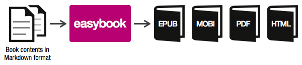

# easybook #

*«book publishing as easy as it should be»*

**[easybook](http://easybook-project.org)** lets you easily publish books in
various electronic formats (ePub, MOBI, PDF and HTML). It was originally designed to
publish programming books, but you can use **easyboook** to publish any kind of
book, manual or documentation website.



## Installation ##

**easybook** can be installed in three different ways depending upon your needs:

  1. **ZIP** installation: best suited for users who want to try **easybook**
     features as fast and easy as possible.
  2. **Composer** installation: recommended for regular users who want to use
     **easybook** for publishing books and documentation.
  3. **Git** installation: reserved for advanced developers who want to hack and
     modify **easybook**.

Regardless the way you install it, use **easybook** with the `book` command:

```
$ cd <easybook-installation-dir>
$ ./book
```

If the last command doesn't work, try `php book` or check `book` script
permissions.

### 1. ZIP installation ###

  1. Download [easybook.zip](https://github.com/javiereguiluz/easybook-package/blob/master/easybook.zip?raw=true) file.
  2. Uncompress `easybook.zip` file in any directory.

### 2. Composer installation ###

Execute the following command to install easybook and all its dependencies in
'easybook' directory:

```
$ php composer.phar create-project easybook/easybook easybook
```

This method requires that [Composer](http://getcomposer.org/) is previously
installed on your system. You can install it simply by executing the
following command:

```
$ curl -s http://getcomposer.org/installer | php
```

### 3. Git installation ###

```
// clone easybook repository
$ mkdir easybook
$ git clone http://github.com/javiereguiluz/easybook.git easybook

// download vendors and dependencies
$ cd easybook
$ php composer.phar install
```

This method requires that [Composer](http://getcomposer.org/) is previously
installed on your system. You can install it simply by executing the
following command:

```
$ curl -s http://getcomposer.org/installer | php
```

## Documentation ##

**easybook** is fully documented at http://easybook-project.org/documentation

## License ##

**easybook** is licensed under the [MIT license](LICENSE.md).

## Tests ##

Execute the following command to test **easybook** (requires PHPUnit):

```
$ cd <easybook-installation-dir>
$ phpunit
```

### Code Quality Assurance ###

| SensioLabs Insight | Travis CI | Scrutinizer CI
| ------------------ | --------- | --------------
| [](https://insight.sensiolabs.com/projects/34c47e7f-a523-4702-8310-ebec02a6a241) | [](http://travis-ci.org/javiereguiluz/easybook) | [](https://scrutinizer-ci.com/g/javiereguiluz/easybook/) [](https://scrutinizer-ci.com/g/javiereguiluz/easybook/)

## Requirements ##

In order to generate PDF files, PrinceXML library must be installed. 
If you haven't installed it yet, you can download a fully-functional demo at: 

    http://www.princexml.com/download

In order to generate MOBI files, KindleGen library must be installed.
If you haven't installed it yet, you can download it freely at Amazon:

    http://amzn.to/kindlegen
